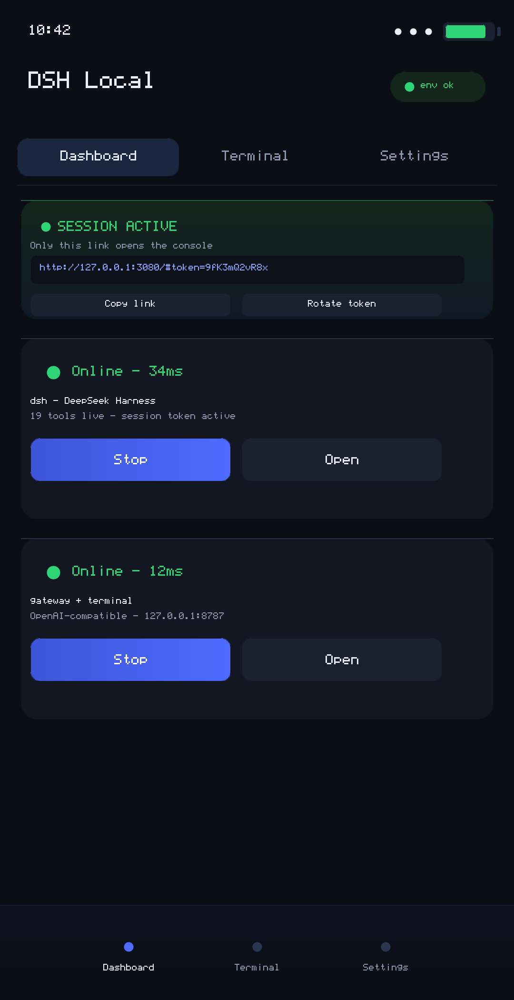
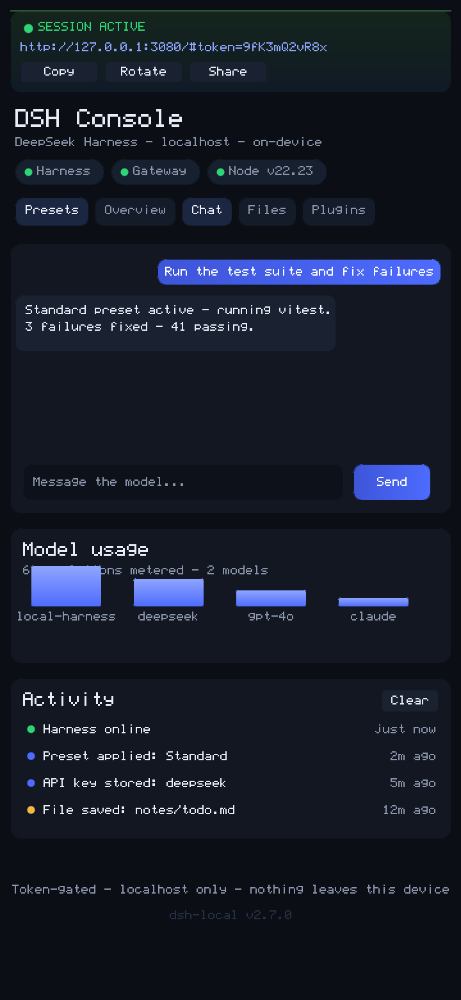
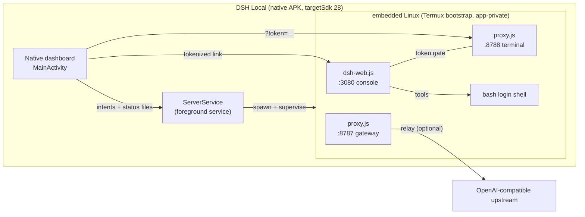

<div align="center">

# 🔥 DSH Local

**A complete AI coding-agent stack in one native Android app.**

Embedded Linux · DeepSeek Harness console · OpenAI-compatible gateway · real terminal —
all on `127.0.0.1`, all on-device, zero cloud, zero accounts.

[](#version-history)
[](#requirements)
[](#testing)
[](#the-web-page-in-this-repo)
[]()

**[🌐 Website](https://canelaslorenzoenego-ai.github.io/dsh-local/)** · **[⬇ Download the APK](#quick-start)** · **[Architecture](#architecture)** · **[Build from source](#build-from-source)** · **[FAQ](#faq)**

</div>

---

## What is this?

DSH Local is a native Java Android app that ships an entire Linux-powered agent
workstation inside a single ~30 MB APK:

1. **First launch** unpacks the official **Termux bootstrap** (aarch64 Linux userland)
   into app-private storage — no Termux install, no F-Droid, no root.
2. Two local **Node.js servers** run inside that environment:
   - the **DeepSeek Harness console** — manage agent presets, plugins, skills, MCPs
     and integrations from a web UI at `127.0.0.1:3080`
   - an **OpenAI-compatible gateway** at `127.0.0.1:8787` any client can point at
3. A real **bash terminal** (xterm.js) lives at `127.0.0.1:8788` — in-app or in Chrome.
4. The **native dashboard** ties it together: two Start/Stop buttons, a live
   **tokenized session link**, a Terminal tab, and a PIN lock. That's the whole UI.

> Everything listens on loopback only. Nothing leaves the device except the
> outbound calls *you* configure (model APIs, git remotes, web fetches).

| Native dashboard | dsh web console |
|---|---|
|  |  |

**Jump to:** [What is this?](#what-is-this) · [Quick start](#quick-start) · [Architecture](#architecture) · [Session tokens](#the-session-token-model-real-dsh-web-behavior) · [Console](#the-agent-console-3080) · [Gateway](#gateway-configuration-8787) · [Data map](#where-your-data-lives) · [API reference](#rest-api-reference) · [Compare](#how-it-compares) · [Security](#security-model) · [Build](#build-from-source) · [FAQ](#faq)

## Quick start

1. **Download** [`public/downloads/dsh-local-v2.7.0.apk`](public/downloads/dsh-local-v2.7.0.apk)
   (or grab it from the [website](https://canelaslorenzoenego-ai.github.io/dsh-local/))
   and sideload it (allow *install unknown apps* when prompted).
2. **Open the app.** The embedded Linux extracts itself on first open (~30 s, one time)
   with live progress on the harness card.
3. **Tap Start** on the DeepSeek Harness card. First boot installs Node.js (~1–2 min).
   A green **session link card** appears at the top of the dashboard:
   `http://127.0.0.1:3080/#token=…`
4. **Tap Open** — the console launches in-app or in Chrome. Only the tokenized link
   opens it.
5. *(Optional)* Tap **Start** on the Proxy Gateway for the model gateway + terminal.
6. **Chat with a model** from the console's Chat tab — every completion is metered
   into the usage dashboard, and both servers log to the Activity feed.

**Requirements**

| | |
|---|---|
| **Device** | Android 8.0+ (API 26), ARM64. No root, no Termux install. |
| **Storage** | ~300 MB after first run (embedded Linux + Node.js). |
| **Network** | None to boot; needed only for model APIs, git remotes, web fetch. |
| **Permissions** | Internet, foreground service, vibration — nothing else. |

## Architecture



**Ports**

| Port | Service | Auth |
|---|---|---|
| `3080` | Harness console (SPA + REST API) | session token required |
| `8787` | OpenAI-compatible gateway | optional API keys (`gateway.json`) |
| `8788` | Terminal (xterm.js) | shared session token required |

The two servers also talk to each other: the console's chat playground calls the
gateway over loopback, and both write into one shared event log + usage ledger.

Native ↔ server communication is the same story in reverse: the dashboard polls
liveness directly on the three ports and reads `status-*.json` files the service
writes; every WebView open carries the session token automatically. When the
notification is tapped while servers run, the app resumes straight to the console
or the terminal — whichever was last started.

## The session-token model (real `dsh web` behavior)

This is the same flow you know from running `dsh web` in Termux:

- Starting the harness **generates a session token** and prints the tokenized link —
  on the console, and on a dedicated card at the top of the native dashboard.
- The console and terminal **only open through that link**. Without it you get a lock
  screen; every `/api/*` route returns `401`.
- **Rotate token** from the dashboard (or console) instantly kills every copy of the
  old link and mints a new one.
- The token lives in `$HOME/dsh-data/session.json` (`0600`, app-private) and survives
  server restarts — rotate it and restart to revoke everything.

REST session endpoints:

| Endpoint | Auth | Purpose |
|---|---|---|
| `GET /api/session` | none | returns `{token, link, rotations}` — this is what the dashboard shows |
| `POST /api/session/exchange {token}` | none | validates a token, returns the fresh link (used by the SPA on `#token=…`) |
| `POST /api/session/rotate` | token | mint a new token, invalidate the old |

Tokens are accepted as `?token=…`, `Authorization: Bearer …`, or `x-dsh-token: …`.

## Where your data lives

Everything is inside the app's private storage — Android's file manager can't see
it, and uninstalling wipes all of it:

| Path | What |
|---|---|
| `$HOME/dsh-data/state.json` | presets, toolset, agent policy, profiles, masked keys |
| `$HOME/dsh-data/session.json` | the session token (0600) — delete = new token on next boot |
| `$HOME/dsh-data/secrets.json` | integration keys in plaintext (0600) for agent shell use |
| `$HOME/dsh-data/usage.json` | metered completions per model / per tool |
| `$HOME/dsh-data/events.json` | activity feed (last 200 events) |
| `$HOME/dsh-data/chats/` | chat conversations |
| `$HOME/workspace/` | the agent's file root — the Files tab and the agent both live here |
| `$HOME/gateway.json` | gateway config (upstream, API keys, models) |

Full reset = Android Settings → Apps → DSH Local → **Clear data**.

## REST API reference

All routes under `/api/*` require the session token (`?token=`, `Authorization:
Bearer`, or `x-dsh-token`), except `/healthz` and `/api/session*`. JSON in/out.

| Method + path | Purpose |
|---|---|
| `GET /api/status` | liveness of all three ports, preset, tool count, usage totals, event count, session meta |
| `GET /api/session` | token + tokenized link (the link source) |
| `POST /api/session/exchange {token}` | validate a token, get the fresh link |
| `POST /api/session/rotate` | mint new token, kill all old links |
| `GET /api/presets` | the four dsh presets with tool counts + saved profiles |
| `POST /api/presets/apply {id}` | atomically apply a preset |
| `POST /api/presets/custom {tools,agent,name?}` | apply a custom toolset; optionally save as a named profile |
| `GET /api/presets/load?id=preset\|current` | toolset for the editor/import flow |
| `POST /api/presets/profile/apply · /delete` | apply / delete a saved profile |
| `GET /api/catalog` | the 30-entry tool catalog (plugins, skills, MCPs, integrations) |
| `GET /api/tool?type=&id=` | one entry's sub-tools, docs, availability |
| `POST /api/install · /uninstall` | enable / disable one tool |
| `POST /api/keys {integration,key}` | store an integration key (masked + vaulted) |
| `GET /api/secrets` | which integration ids are set (never values) |
| `POST /api/test {type,id}` | wiring test for a tool or integration |
| `GET /api/chats · POST /api/chat` | list conversations · send a message through the gateway |
| `GET /api/files?dir= · /read · /write · /delete` | workspace browser (traversal-safe) |
| `GET /api/usage` | metered completions per model / tool |
| `GET /api/events · POST /api/events/ack` | activity feed · clear it |
| `GET /api/installed` | raw state.json (keys masked) |

## How it compares

| | DSH Local | Termux + manual dsh | Cloud agent in a browser |
|---|---|---|---|
| Install effort | one APK | pkg installs + configs | account + subscription |
| Root/Termux needed | no | Termux required | — |
| Runs fully on-device | yes | yes | no |
| Session-token console | yes | manual | vendor-specific |
| Gateway for other apps | built-in | build it yourself | no |
| Offline-capable boot | yes | yes | no |
| PIN/screen privacy | built-in | no | no |
| Data location | app-private | Termux home | vendor cloud |

## Security model

A complete management SPA for the harness, file-backed in `$HOME/dsh-data/state.json`:

- **Presets** — dsh's four real compositions, applied atomically:

  | Preset | Tools | Auto-approve | Swarms | Notes |
  |---|---|---|---|---|
  | 📦 **Standard** | 19 | off | ×4 | full coding agent (dsh default) |
  | ⚡ **PTC** (`code`) | 19 | off | ×4 | tools via the Code Mode SDK — one TypeScript program instead of many round-trips |
  | 🎯 **Minimal** | 2 | off | ×1 | persistent bash + `str_replace_editor`, one-line prompt, no compaction |
  | 🧬 **Creator** (`cordis`) | 22 | **on** | ×8 | + Runtime Inspect, UI Composer, Scheduler — reshapes its own runtime |

- **Custom studio** — start from any preset, flip individual tools, pick a sandbox
  (`read-only` / `workspace-write` / `danger-full-access`), set auto-approve, swarm
  depth (1–16), model route and extra system prompt. Save as named reusable profiles,
  export/import as JSON (server-validated).
- **Tool catalog — 30 entries**, each with sub-tool lists, real documentation,
  preset availability and wiring tests:

  | Type | Count | Highlights |
  |---|---|---|
  | Plugins | 13 | Shell Exec, File I/O, Git, Web Fetch, Plan & Goals, Swarms & Workflows, **Session Manager**, **Trajectory Viewer**, **Sandbox Snapshots**, **Model Router & Usage**, **UI Composer**, **Task Scheduler**, Runtime Inspect |
  | Skills | 9 | Commit Helper, Test Writer, Refactorer, Docs Generator, SQL Assistant, **Code Reviewer**, **Debug Helper**, **AGENTS.md Maintainer**, **Prompt Optimizer** |
  | MCPs | 8 | Memory, Fetch, Git, SQLite, **Filesystem**, **Web Search**, **GitHub**, **Time** |
  | Integrations | 8 | DeepSeek, OpenAI, Anthropic, **OpenRouter**, **Ollama**, GitHub, FreeBuff Proxy, **Slack** |

- **Search + detail sheets** on every tool tab, with live status polling.
- When the real `dsh` core is installable on-device, `setup.sh` also attaches it on
  `:3081` alongside the console.

### Chat playground

A built-in chat client that calls your own gateway over loopback (`/api/chat`):

- Persistent, named conversations — create, switch, delete; history is stored
  app-private in `$HOME/dsh-data/chats/` and survives restarts
- Sliding 12-message window sent per completion, model badge on every reply
- Enter to send, Shift+Enter for newline, typing indicator, optimistic user bubbles
- Works in **echo mode** with zero configuration, or against any real backend you
  point `gateway.json` at — the same path external OpenAI clients take

### Files manager

A workspace browser confined to `~/workspace` (the agent's own root):

- Breadcrumb navigation, folder/file icons, symlink marks, sizes, sorted dirs-first
- Tap to view/edit any text file in a monospace editor; save or delete
- Server-side **path traversal protection**: every read/write resolves inside the
  workspace root — `../` escapes and symlinks out are refused (covered by tests)

### Usage analytics

Every completion through the gateway is metered into `$HOME/dsh-data/usage.json`:

- Calls and messages **per model** (the Overview card renders a bar chart)
- Calls **per tool** (chat today; agent tool calls land in the same ledger)
- Totals surface in `/api/status` so the dashboard and console agree

### Activity feed

An append-only event log (`$HOME/dsh-data/events.json`, newest first, 200 kept)
that records what the stack did without being asked: harness boots, preset applies,
key stores, file saves/deletes, chat turns — each with a severity dot and relative
timestamp. `POST /api/events/ack` clears it (and resets per-boot dedup so repeat
actions log again).

## Gateway configuration (`:8787`)

Point the gateway at any OpenAI-compatible backend (or run it in local echo mode)
by editing `~/gateway.json` from the Terminal tab:

```json
{
  "upstream": "https://api.example.com/v1/chat/completions",
  "upstreamKey": "sk-…",
  "apiKeys": ["my-key"],
  "models": ["my-model-id"]
}
```

- `upstream` — relays `/v1/chat/completions` (streaming SSE included) to the backend
- `apiKeys` — require those bearer keys from clients
- `models` — advertise a custom `/v1/models` list
- no `upstream` → local echo mode (wiring tests)

### Secrets vault

Integration keys are written twice: masked into `state.json` for the UI, and in
plaintext to `$HOME/dsh-data/secrets.json` (**mode 0600**, app-private) so *the
agent itself* can use them:

```bash
# in the Terminal tab
export DEEPSEEK_API_KEY=$(node -p "require('os').homedir() + '/dsh-data/secrets.json'" | xargs cat | node -e "let d='';process.stdin.on('data',c=>d+=c).on('end',()=>console.log(JSON.parse(d).deepseek||''))")
```

The vault endpoint (`GET /api/secrets`) lists which ids are set — never values.

## Security model

- **Loopback only** — every listener binds to `127.0.0.1`. LAN/internet exposure is
  impossible by construction.
- **Session tokens** — console and terminal are gated (see above). Rotate to revoke.
- **PIN lock** — optional 4+ digit PIN at launch; `FLAG_SECURE` blocks screenshots
  and recents thumbnails while locked. Stored in app-private prefs only.
- **Keys stay on-device** — integration keys are stored masked in `state.json`;
  plaintext never round-trips through the API. The optional secrets vault file is
  `0600` app-private, readable only by the embedded Linux user the agent runs as.
- **Workspace confinement** — the files manager resolves every path against the
  workspace root; traversal and symlink escapes are refused and tested.
- **targetSdk 28** — deliberate, same as Termux F-Droid: it bypasses Android 10+'s
  W^X restriction so the embedded Linux can execute from app-private storage.
- **No telemetry, no accounts, no cloud** — the app has nothing to phone home *to*.

## Project layout

```
├── apk/                              # the product: native Android source
│   ├── AndroidManifest.xml           # com.dshlocal.app, targetSdk 28, v2.7.0
│   ├── build.sh                      # aapt2 → javac → d8 → zipalign → apksigner
│   ├── src/com/dshlocal/app/
│   │   ├── MainActivity.java         # dashboard, session-link card, PIN, WebView hosts
│   │   ├── ServerService.java        # foreground service owning both server processes
│   │   ├── BootstrapInstaller.java   # Termux bootstrap extraction (staging → symlinks → atomic)
│   │   └── Prefs.java                # PIN / open-in-app settings
│   ├── assets/
│   │   ├── bootstrap-aarch64.zip     # official Termux bootstrap (extracted on first open)
│   │   ├── dsh-web.js                # console server (:3080) — session auth + REST API
│   │   ├── proxy.js                  # gateway (:8787) + terminal (:8788)
│   │   ├── setup.sh / provision.sh   # node install + toolchain provisioning
│   │   └── web/                      # console SPA + terminal (xterm.js)
│   ├── res/                          # layouts, drawables, animations
│   └── test/smoke.cjs                # 80-assertion end-to-end server test
├── docs/                             # rendered product screenshots (PNG)
├── public/downloads/                 # signed release APK (served by the web page)
├── scripts/
│   ├── publish-to-github.cjs         # push this repo via the GitHub REST API
│   └── screenshot.cjs                # dependency-free renderer for docs/*.png
└── src/                              # single static product/download page (Vite+React)
```

## Build from source

Prerequisites: Linux (or WSL), JDK 17+, `bash`, `unzip`, `curl`. The build script
bootstraps the Android SDK toolchain (aapt2, d8, apksigner, android.jar) into
`$HOME/android-sdk` on first run — no Android Studio needed.

```bash
# build + sign → apk/build/dsh-local.apk
bash apk/build.sh

# run the end-to-end server test suite (boots both servers, no device needed)
node apk/test/smoke.cjs
```

The release APK is signed with a project keystore (`apk/build/dsh.keystore`,
auto-generated) using the v2+v3 signature schemes. Bump `versionCode`/`versionName`
in `apk/AndroidManifest.xml` to cut a new release, then copy the artifact into
`public/downloads/`.

### Testing

`apk/test/smoke.cjs` boots both servers as real child processes against a throwaway
`$HOME` and asserts the full surface: boot/health, the complete token lifecycle
(exchange, rotate, old-token rejection, restart persistence), preset atomicity and
validation, custom studio + profiles, masked key storage, gateway chat + SSE,
terminal token gate, path-traversal protection, and state persistence across
restarts — plus the v2.7.0 systems end-to-end: the chat playground (gateway
round-trip, history accumulation, listing, deletion), usage metering, the files
manager (nested writes, read-back, traversal refusal in all three handlers), the
event log (boot/chat/preset events, ack), and the secrets vault. **80 assertions,
all green.**

### Screenshots

`docs/*.png` are rendered by `scripts/screenshot.cjs` — a dependency-free
bitmap-font rasterizer + PNG encoder that draws the real palette and layout of the
native dashboard and the console, then **pixel-samples its own output** and fails
if any landmark drifts. Regenerate after UI changes:

```bash
node scripts/screenshot.cjs
```

## The website

The product page is **live at [canelaslorenzoenego-ai.github.io/dsh-local](https://canelaslorenzoenego-ai.github.io/dsh-local/)** — hero, feature cards, install steps and the download button pointing at the APK in this repo.

It builds from the same `src/` that powers local previews, deployed by a GitHub
Actions workflow on every push to `main`:

- The Vite app is built with the right base path and the release APK is copied in,
  so the **Download** button serves the real file from the Pages site.
- If Pages isn't enabled yet: repo **Settings → Pages → Source: GitHub Actions** —
  the next push (or re-running the workflow) publishes it. No other setup.
- First deploy takes a minute or two; the workflow appears under the repo's
  **Actions** tab.

Run it locally instead:

```bash
bun install
bun tsc -b --noEmit   # typecheck
bun run dev           # local preview (optional)
```

There is deliberately **no backend** — no Convex, no auth, no database. The site,
the README and the APK are the whole product.

## Publishing updates to GitHub

```bash
GITHUB_TOKEN=ghp_… node scripts/publish-to-github.cjs [repo-name]
```

Creates/updates the repo and pushes a commit of every tracked file via the REST API
(works where the `git` binary is unavailable). Minimum token scope: `repo`.

## FAQ

**Why targetSdk 28 (Android 9)?**
Android 10+ enforces W^X: app-private storage can't hold executable files. targetSdk
28 exempts the app — the same approach Termux F-Droid uses. This is what lets the
embedded Linux execute at all.

**Do I need Termux or root?**
No. The Termux bootstrap is bundled inside the APK and extracted into this app's own
private storage. Nothing else is touched on your device.

**Why does first boot take minutes?**
Two one-time steps: extracting the Linux userland (~30 s), then installing Node.js
inside it (~1–2 min, needs internet). Every later start is fast.

**Is this official DeepSeek software?**
No. DSH Local is an independent, unofficial project *for* the DeepSeek Harness
ecosystem. It bundles our own console implementation and — when installable — the
official `dsh` core. Not affiliated with or endorsed by DeepSeek.

**How do I reset everything?**
Android Settings → Apps → DSH Local → Clear data. That wipes the embedded Linux,
all state and keys. The PIN lock is also cleared.

**A server won't start / the link shows nothing**
Open the **Terminal** tab and check the boot log. Most issues are first-run Node
installs failing offline — reconnect and press Start again. Bootstrap failures show
an inline error on the harness card; press Start to retry.

## Version history

| Version | Notes |
|---|---|
| v1.0.0 | Termux-bridge prototype (removed) |
| v2.0.0 | Full rebuild: embedded Linux, two servers, terminal, PIN |
| v2.1.0 | Auto-bootstrap on first open |
| v2.2.0 | Plugins / skills / MCPs / integrations console |
| v2.3.1 | dsh's real presets (Standard / PTC / Minimal / Creator) |
| v2.4.0 | Custom preset studio + provisioned container |
| v2.5.1 | Animations, tool search/info, 43/43 smoke test green |
| v2.6.0 | Session-token auth (dsh tokenized links), catalog 13/9/8/8, dashboard session card — 61/61 green |
| **v2.7.0** | **Chat playground, files manager, usage analytics, activity feed, secrets vault, notification tap-through, in-app console — 80/80 green** |

---

<div align="center">
<sub>Built to run your agent, your model, your keys — entirely on your phone.</sub>
</div>
