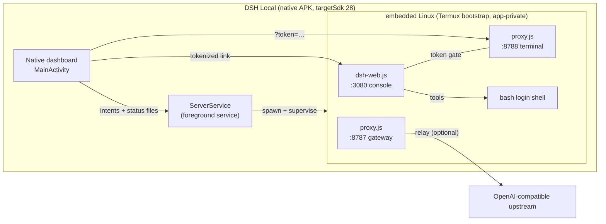

<div align="center">

# 🔥 DSH Local

**A complete AI coding-agent stack in one native Android app.**

Embedded Linux · DeepSeek Harness console · OpenAI-compatible gateway · real terminal —
all on `127.0.0.1`, all on-device, zero cloud, zero accounts.

[](#version-history)
[](#requirements)
[](#testing)
[](#the-web-page-in-this-repo)
[]()

**[⬇ Download the APK](#quick-start)** · **[Architecture](#architecture)** · **[Build from source](#build-from-source)** · **[FAQ](#faq)**

</div>

---

## What is this?

DSH Local is a native Java Android app that ships an entire Linux-powered agent
workstation inside a single ~30 MB APK:

1. **First launch** unpacks the official **Termux bootstrap** (aarch64 Linux userland)
   into app-private storage — no Termux install, no F-Droid, no root.
2. Two local **Node.js servers** run inside that environment:
   - the **DeepSeek Harness console** — manage agent presets, plugins, skills, MCPs
     and integrations from a web UI at `127.0.0.1:3080`
   - an **OpenAI-compatible gateway** at `127.0.0.1:8787` any client can point at
3. A real **bash terminal** (xterm.js) lives at `127.0.0.1:8788` — in-app or in Chrome.
4. The **native dashboard** ties it together: two Start/Stop buttons, a live
   **tokenized session link**, a Terminal tab, and a PIN lock. That's the whole UI.

> Everything listens on loopback only. Nothing leaves the device except the
> outbound calls *you* configure (model APIs, git remotes, web fetches).

## Quick start

1. **Download** [`public/downloads/dsh-local-v2.6.0.apk`](public/downloads/dsh-local-v2.6.0.apk)
   and sideload it (allow *install unknown apps* when prompted).
2. **Open the app.** The embedded Linux extracts itself on first open (~30 s, one time)
   with live progress on the harness card.
3. **Tap Start** on the DeepSeek Harness card. First boot installs Node.js (~1–2 min).
   A green **session link card** appears at the top of the dashboard:
   `http://127.0.0.1:3080/#token=…`
4. **Tap Open** — the console launches in-app or in Chrome. Only the tokenized link
   opens it.
5. *(Optional)* Tap **Start** on the Proxy Gateway for the model gateway + terminal.

| | |
|---|---|
| **Requirements** | Android 8.0+ (API 26), ARM64 device |
| **Storage** | ~300 MB after first run (Linux + Node) |
| **Network** | None required to boot; needed only for model APIs / web fetch |
| **Permissions** | Internet, foreground service, vibration. Nothing else. |

## Architecture



**Ports**

| Port | Service | Auth |
|---|---|---|
| `3080` | Harness console (SPA + REST API) | session token required |
| `8787` | OpenAI-compatible gateway | optional API keys (`gateway.json`) |
| `8788` | Terminal (xterm.js) | shared session token required |

## The session-token model (real `dsh web` behavior)

This is the same flow you know from running `dsh web` in Termux:

- Starting the harness **generates a session token** and prints the tokenized link —
  on the console, and on a dedicated card at the top of the native dashboard.
- The console and terminal **only open through that link**. Without it you get a lock
  screen; every `/api/*` route returns `401`.
- **Rotate token** from the dashboard (or console) instantly kills every copy of the
  old link and mints a new one.
- The token lives in `$HOME/dsh-data/session.json` (`0600`, app-private) and survives
  server restarts — rotate it and restart to revoke everything.

REST session endpoints:

| Endpoint | Auth | Purpose |
|---|---|---|
| `GET /api/session` | none | returns `{token, link, rotations}` — this is what the dashboard shows |
| `POST /api/session/exchange {token}` | none | validates a token, returns the fresh link (used by the SPA on `#token=…`) |
| `POST /api/session/rotate` | token | mint a new token, invalidate the old |

Tokens are accepted as `?token=…`, `Authorization: Bearer …`, or `x-dsh-token: …`.

## The agent console (`:3080`)

A complete management SPA for the harness, file-backed in `$HOME/dsh-data/state.json`:

- **Presets** — dsh's four real compositions, applied atomically:

  | Preset | Tools | Auto-approve | Swarms | Notes |
  |---|---|---|---|---|
  | 📦 **Standard** | 19 | off | ×4 | full coding agent (dsh default) |
  | ⚡ **PTC** (`code`) | 19 | off | ×4 | tools via the Code Mode SDK — one TypeScript program instead of many round-trips |
  | 🎯 **Minimal** | 2 | off | ×1 | persistent bash + `str_replace_editor`, one-line prompt, no compaction |
  | 🧬 **Creator** (`cordis`) | 22 | **on** | ×8 | + Runtime Inspect, UI Composer, Scheduler — reshapes its own runtime |

- **Custom studio** — start from any preset, flip individual tools, pick a sandbox
  (`read-only` / `workspace-write` / `danger-full-access`), set auto-approve, swarm
  depth (1–16), model route and extra system prompt. Save as named reusable profiles,
  export/import as JSON (server-validated).
- **Tool catalog — 30 entries**, each with sub-tool lists, real documentation,
  preset availability and wiring tests:

  | Type | Count | Highlights |
  |---|---|---|
  | Plugins | 13 | Shell Exec, File I/O, Git, Web Fetch, Plan & Goals, Swarms & Workflows, **Session Manager**, **Trajectory Viewer**, **Sandbox Snapshots**, **Model Router & Usage**, **UI Composer**, **Task Scheduler**, Runtime Inspect |
  | Skills | 9 | Commit Helper, Test Writer, Refactorer, Docs Generator, SQL Assistant, **Code Reviewer**, **Debug Helper**, **AGENTS.md Maintainer**, **Prompt Optimizer** |
  | MCPs | 8 | Memory, Fetch, Git, SQLite, **Filesystem**, **Web Search**, **GitHub**, **Time** |
  | Integrations | 8 | DeepSeek, OpenAI, Anthropic, **OpenRouter**, **Ollama**, GitHub, FreeBuff Proxy, **Slack** |

- **Search + detail sheets** on every tool tab, with live status polling.
- When the real `dsh` core is installable on-device, `setup.sh` also attaches it on
  `:3081` alongside the console.

## Gateway configuration (`:8787`)

Point the gateway at any OpenAI-compatible backend (or run it in local echo mode)
by editing `~/gateway.json` from the Terminal tab:

```json
{
  "upstream": "https://api.example.com/v1/chat/completions",
  "upstreamKey": "sk-…",
  "apiKeys": ["my-key"],
  "models": ["my-model-id"]
}
```

- `upstream` — relays `/v1/chat/completions` (streaming SSE included) to the backend
- `apiKeys` — require those bearer keys from clients
- `models` — advertise a custom `/v1/models` list
- no `upstream` → local echo mode (wiring tests)

## Security model

- **Loopback only** — every listener binds to `127.0.0.1`. LAN/internet exposure is
  impossible by construction.
- **Session tokens** — console and terminal are gated (see above). Rotate to revoke.
- **PIN lock** — optional 4+ digit PIN at launch; `FLAG_SECURE` blocks screenshots
  and recents thumbnails while locked. Stored in app-private prefs only.
- **Keys stay on-device** — integration keys are stored masked in `state.json`;
  plaintext never round-trips through the API.
- **targetSdk 28** — deliberate, same as Termux F-Droid: it bypasses Android 10+'s
  W^X restriction so the embedded Linux can execute from app-private storage.
- **No telemetry, no accounts, no cloud** — the app has nothing to phone home *to*.

## Project layout

```
├── apk/                              # the product: native Android source
│   ├── AndroidManifest.xml           # com.dshlocal.app, targetSdk 28, v2.6.0
│   ├── build.sh                      # aapt2 → javac → d8 → zipalign → apksigner
│   ├── src/com/dshlocal/app/
│   │   ├── MainActivity.java         # dashboard, session-link card, PIN, WebView hosts
│   │   ├── ServerService.java        # foreground service owning both server processes
│   │   ├── BootstrapInstaller.java   # Termux bootstrap extraction (staging → symlinks → atomic)
│   │   └── Prefs.java                # PIN / open-in-app settings
│   ├── assets/
│   │   ├── bootstrap-aarch64.zip     # official Termux bootstrap (extracted on first open)
│   │   ├── dsh-web.js                # console server (:3080) — session auth + REST API
│   │   ├── proxy.js                  # gateway (:8787) + terminal (:8788)
│   │   ├── setup.sh / provision.sh   # node install + toolchain provisioning
│   │   └── web/                      # console SPA + terminal (xterm.js)
│   ├── res/                          # layouts, drawables, animations
│   └── test/smoke.cjs                # 61-assertion end-to-end server test
├── public/downloads/                 # signed release APK (served by the web page)
├── scripts/publish-to-github.cjs     # push this repo via the GitHub REST API
└── src/                              # single static product/download page (Vite+React)
```

## Build from source

Prerequisites: Linux (or WSL), JDK 17+, `bash`, `unzip`, `curl`. The build script
bootstraps the Android SDK toolchain (aapt2, d8, apksigner, android.jar) into
`$HOME/android-sdk` on first run — no Android Studio needed.

```bash
# build + sign → apk/build/dsh-local.apk
bash apk/build.sh

# run the end-to-end server test suite (boots both servers, no device needed)
node apk/test/smoke.cjs
```

The release APK is signed with a project keystore (`apk/build/dsh.keystore`,
auto-generated) using the v2+v3 signature schemes. Bump `versionCode`/`versionName`
in `apk/AndroidManifest.xml` to cut a new release, then copy the artifact into
`public/downloads/`.

### Testing

`apk/test/smoke.cjs` boots both servers as real child processes against a throwaway
`$HOME` and asserts the full surface: boot/health, the complete token lifecycle
(exchange, rotate, old-token rejection, restart persistence), preset atomicity and
validation, custom studio + profiles, masked key storage, gateway chat + SSE,
terminal token gate, path-traversal protection, and state persistence across
restarts. **61 assertions, all green.**

## The web page in this repo

`src/` is a single static product/download page (Vite + React + Tailwind v4 +
shadcn/ui, Framer Motion) that documents the app and serves the APK from
`/downloads/`. There is deliberately **no backend** — no Convex, no auth, no
database. The page and the APK are the whole product.

```bash
bun install
bun tsc -b --noEmit   # typecheck
bun run dev           # local preview (optional)
```

## Publishing updates to GitHub

```bash
GITHUB_TOKEN=ghp_… node scripts/publish-to-github.cjs [repo-name]
```

Creates/updates the repo and pushes a commit of every tracked file via the REST API
(works where the `git` binary is unavailable). Minimum token scope: `repo`.

## FAQ

**Why targetSdk 28 (Android 9)?**
Android 10+ enforces W^X: app-private storage can't hold executable files. targetSdk
28 exempts the app — the same approach Termux F-Droid uses. This is what lets the
embedded Linux execute at all.

**Do I need Termux or root?**
No. The Termux bootstrap is bundled inside the APK and extracted into this app's own
private storage. Nothing else is touched on your device.

**Why does first boot take minutes?**
Two one-time steps: extracting the Linux userland (~30 s), then installing Node.js
inside it (~1–2 min, needs internet). Every later start is fast.

**Is this official DeepSeek software?**
No. DSH Local is an independent, unofficial project *for* the DeepSeek Harness
ecosystem. It bundles our own console implementation and — when installable — the
official `dsh` core. Not affiliated with or endorsed by DeepSeek.

**How do I reset everything?**
Android Settings → Apps → DSH Local → Clear data. That wipes the embedded Linux,
all state and keys. The PIN lock is also cleared.

**A server won't start / the link shows nothing**
Open the **Terminal** tab and check the boot log. Most issues are first-run Node
installs failing offline — reconnect and press Start again. Bootstrap failures show
an inline error on the harness card; press Start to retry.

## Version history

| Version | Notes |
|---|---|
| v1.0.0 | Termux-bridge prototype (removed) |
| v2.0.0 | Full rebuild: embedded Linux, two servers, terminal, PIN |
| v2.1.0 | Auto-bootstrap on first open |
| v2.2.0 | Plugins / skills / MCPs / integrations console |
| v2.3.1 | dsh's real presets (Standard / PTC / Minimal / Creator) |
| v2.4.0 | Custom preset studio + provisioned container |
| v2.5.1 | Animations, tool search/info, 43/43 smoke test green |
| **v2.6.0** | **Session-token auth (dsh tokenized links), catalog 13/9/8/8, dashboard session card — 61/61 green** |

---

<div align="center">
<sub>Built to run your agent, your model, your keys — entirely on your phone.</sub>
</div>
